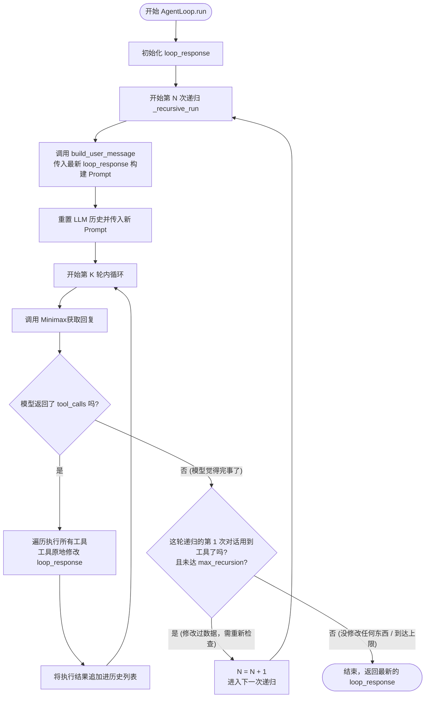

# CaveClaw Agent Loop (src/agent_loop.py) 核心设计说明

`src/agent_loop.py` 提供了一个**双层嵌套（内循环多轮对话 + 外循环递归重试）**的轻量级 LLM 工具调用执行框架。该版本与 `agent_core` 下的异步事件驱动流不同，它是一个更加面向**状态突变（State Mutation）**和**结果审视（Recursive Review）**的紧凑型架构，高度耦合于 `MinimaxCalling` 客户端。

## 1. 核心设计思路

### A. 双层循环架构 (The Dual-Loop Architecture)
这是整个文件最精髓的设计，解决了大模型在处理复杂、长链路任务时“上下文越来越长、容易产生幻觉迷失”的痛点。

*   **内循环 (Rounds, 由 `max_rounds` 控制)**：
    *   在同一个 `messages` 上下文历史中，大模型不断地发出工具调用请求 -> 执行器执行 -> 执行器结果追加到 `messages` -> 大模型再继续思考推理。
    *   这适用于短期、连贯的任务（如先搜索资料，再根据资料更新数据）。
*   **外循环 (Recursion, 由 `max_recursion` 控制)**：
    *   **触发条件**：当模型在内循环的第一轮**确实调用了工具**，并在多次内循环后认为自己“搞完了”（即不再输出 `tool_calls`）。
    *   **核心动作_状态重置_**：它会把之前冗长对话的 `messages` 历史**直接清空**。只保留包含最新状态（`loop_response`）的重新构建的 `user_message`。
    *   **设计目的**：让大模型以“上帝视角”重新审视刚刚自己修改过后的完整结果。消除之前试错、思考过程的上下文噪音，确保最终产出的准确度。

### B. 基于共享状态的数据流转 (`loop_response`)
传统的 Agent 往往是依靠字符串或者零散的变量传递。而在 `AgentLoop` 中：
*   所有数据都被集中在一个叫 `loop_response` 的 Python 字典中。
*   工具执行器 (`tool_executor`) 的唯二入参就是 `(tool_call, loop_response)`。
*   工具的内部逻辑直接原地修改（Mutate）这个 `loop_response`。
*   每次递归前，通过 `build_user_message(loop_response)` 将这团内存变量序列化为字符串，回显给 LLM 让其检查。

### C. 通用增删改查工具库 (CRUD Tool Factories)
框架在底部提供了一组极度实用的高阶函数：`create_edit_tools` 和 `create_edit_executor`。
*   **设计目的**：大模型最常做的操作就是对一个 JSON 数组/结构体进行“增删改查”。这套工具可以快速生成标准的 `append`, `update`, `delete` 函数绑定给大模型。
*   这极大降低了编写结构化信息产出（例如：分镜脚本生成、角色设定表生成）Agent 的心智负担。

---

## 2. 组件交互流程图

## 3. 为什么这样设计？(架构收益)

1.  **极简的无状态刷新**：通过 `_recursive_run` 构建了强迫 LLM “写完再回头阅读一遍全稿”的审视机制（Review Mechanism），这对保证 JSON 输出结构化、数据长文不遗漏非常关键。
2.  **解耦的抽象层**：将“怎么发请求（Minimax）”和“如何修改数据（`tool_executor`）”彻底拆分。Agent 引擎只管调度，具体的业务逻辑全在外部回调（Closure/Callable）里。
3.  **内建的保护防线**：双层限制 （`max_rounds` 和 `max_recursion`）能完美卡住大模型“死循环重复调用某报错工具”或者“做了一点改动就无限陷入强迫症审视”。
4.  **低门槛的工具厂（Tool Factory）**：内置通用的增删改查脚手架函数，只需要给个存储键名（如 `data_key="characters"` ），瞬间自动生产好 3 个 CRUD 工具绑定给大模型。
